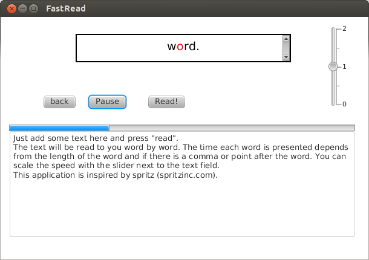

FastRead
==============
This is a tool for faster reading. The words of a given text are displayed to you one after another, so the eye can focus on just one word. This way, the eye doesn't have to move to recognize word after word. Additionaly, the middle character of a word is highlighted. Longer words as well as sentence endings will be displayed slightly longer.   

This tool is inspired by Spritz (spritzinc.com) but doesn't use any of their code. If someone has problems with this application, please contact me at steven@stevenschwenke.de